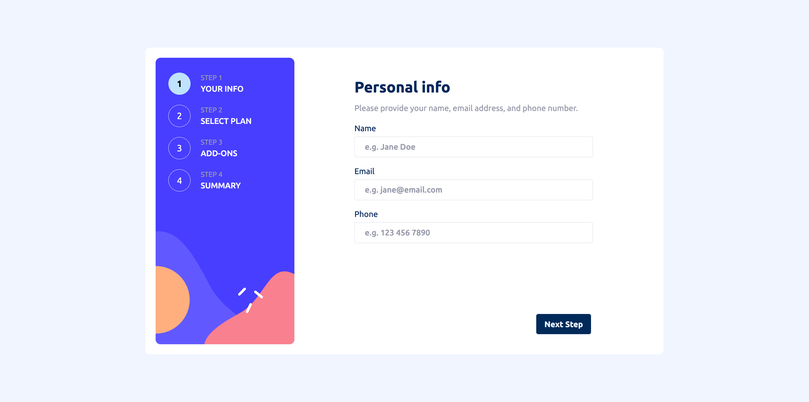

# Frontend Mentor - Multi-step form solution

This is a solution to the [Multi-step form challenge on Frontend Mentor](https://www.frontendmentor.io/challenges/multistep-form-YVAnSdqQBJ). Frontend Mentor challenges help you improve your coding skills by building realistic projects.

## Table of contents

- [Overview](#overview)
  - [The challenge](#the-challenge)
  - [Screenshot](#screenshot)
  - [Links](#links)
- [My process](#my-process)
  - [Built with](#built-with)
  - [Useful resources](#useful-resources)
- [Author](#author)

## Overview

### The challenge

Users should be able to:

- Complete each step of the sequence
- Go back to a previous step to update their selections
- See a summary of their selections on the final step and confirm their order
- View the optimal layout for the interface depending on their device's screen size
- See hover and focus states for all interactive elements on the page
- Receive form validation messages if:
  - A field has been missed
  - The email address is not formatted correctly
  - A step is submitted, but no selection has been made

### Screenshot

### Links

- [Solution](https://your-solution-url.com)
- [Live Site](https://your-live-site-url.com)

## My process

### Built with

- Semantic HTML5 markup
- Flexbox
- CSS Grid
- Mobile-first workflow
- [React](https://reactjs.org/) - JS library
- [Vite](https://vitejs.dev/) - Frontend development build tool
- [Tailwind CSS](https://tailwindcss.com/) - CSS framework
- [shadcn ui](https://ui.shadcn.com/) - UI library
- [TypeScript](https://www.typescriptlang.org/) - JavaScript with syntax for types
- [React Context](https://react.dev/reference/react/useContext) - Manage state
- [React Hook Form](https://react-hook-form.com/) - React form library
- [Zod](https://zod.dev/) - TypeScript-first schema validation

### Useful resources

- [React TypeScript Cheatsheet](https://react-typescript-cheatsheet.netlify.app/) - Reference to help me understand how to use TS in React Context.
- [Codevolution](https://www.youtube.com/playlist?list=PLC3y8-rFHvwjmgBr1327BA5bVXoQH-w5s) - Learned how to use react hook form
- [React hook form Controller](https://react-hook-form.com/docs/usecontroller/controller)

## Author

- Frontend Mentor - [@Garcia-Jr](https://www.frontendmentor.io/profile/Garcia-Jr)
